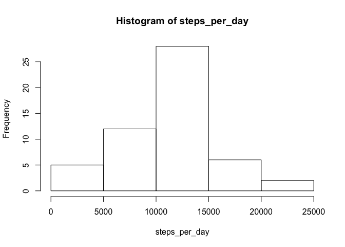
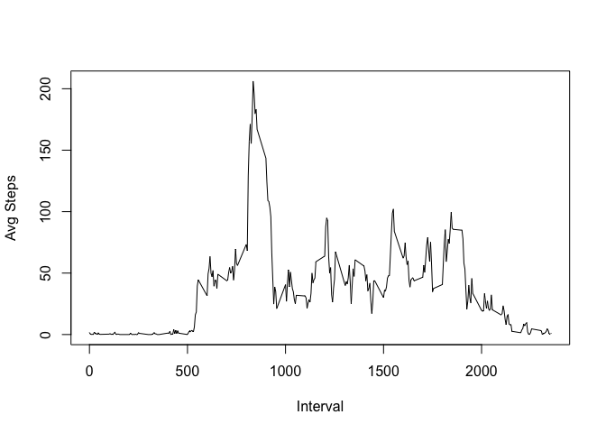
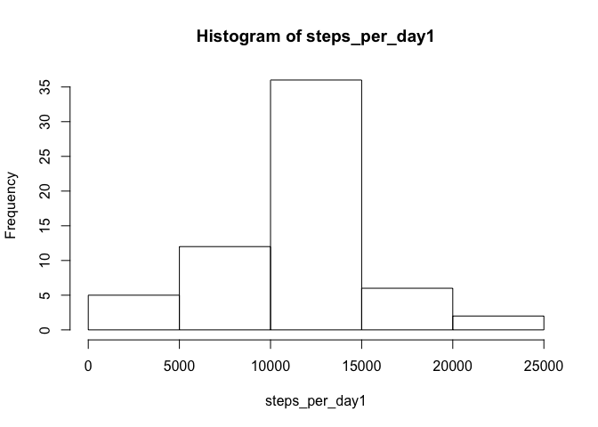
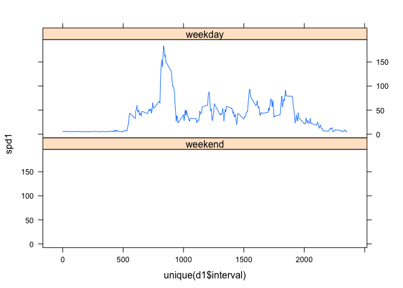

# Reproducible Research: Peer Assessment 1


### Loading and preprocessing the data


```r
d <- read.csv("activity.csv")
```

I'm loading the activity data using *read.csv* function. No specific processing of data is required for now.

### What is mean total number of steps taken per day?


```r
steps_per_day <- tapply(d$steps, d$date, sum)
hist(steps_per_day)
```

 

The *mean* value is **10770** and *median* value is **10760**.


### What is the average daily activity pattern?

```r
spd <- tapply(d$steps, d$interval, mean, na.rm=T)
plot(unique(d$interval),spd, type="l",xlab = "Interval",ylab = "Avg Steps")
```

 

Interval **835** contains the maximum number of steps.

### Imputing missing values
- Missing values in our data.frame

```
## [1] "NA's   :2304  "
```
- Imputing the data using **Hmisc** library

```
## Warning: package 'Hmisc' was built under R version 3.1.2
```

```
## Loading required package: grid
## Loading required package: lattice
```

```
## Warning: package 'lattice' was built under R version 3.1.2
```

```
## Loading required package: survival
```

```
## Warning: package 'survival' was built under R version 3.1.2
```

```
## Loading required package: Formula
```

```
## Warning: package 'Formula' was built under R version 3.1.2
```

```
## Loading required package: ggplot2
```

```
## Warning: package 'ggplot2' was built under R version 3.1.2
```

```
## 
## Attaching package: 'Hmisc'
## 
## The following objects are masked from 'package:base':
## 
##     format.pval, round.POSIXt, trunc.POSIXt, units
```
- Plotting the hist

```r
steps_per_day1 <- tapply(d1$steps, d1$date, sum)
hist(steps_per_day1)
```

 

New *mean* value is **10770** and *median* value is **10770**.

I have used mean value for imputing the missing data. I have found that the revised mean and median value is almost the same.

### Are there differences in activity patterns between weekdays and weekends?
- Creating weekday/weekend factor data

```r
d1$wk <- factor((weekdays(as.Date(d1$date)) %in% c('Monday', 'Tuesday', 'Wednesday', 'Thursday', 'Friday'))+1L, levels=1:2, labels=c('weekend', 'weekday'))

library(lattice)
```


```r
spd1 <- tapply(d1$steps, d1$interval, mean, na.rm=T)
xyplot(spd1~unique(d1$interval) | factor(d1$wk), data=d1, type="l",layout=c(1,2))
```

 
